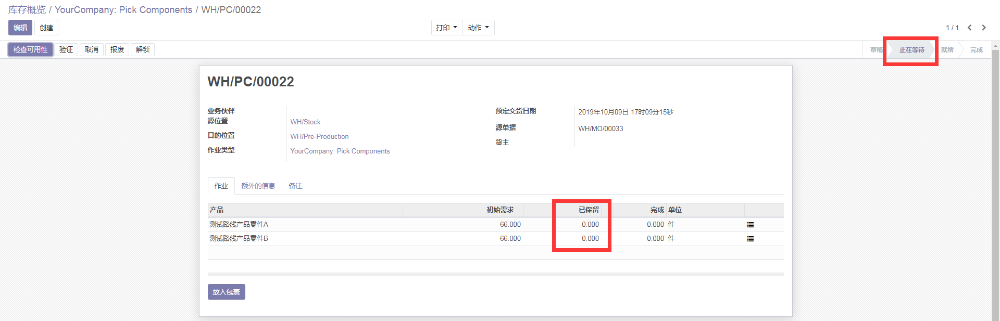
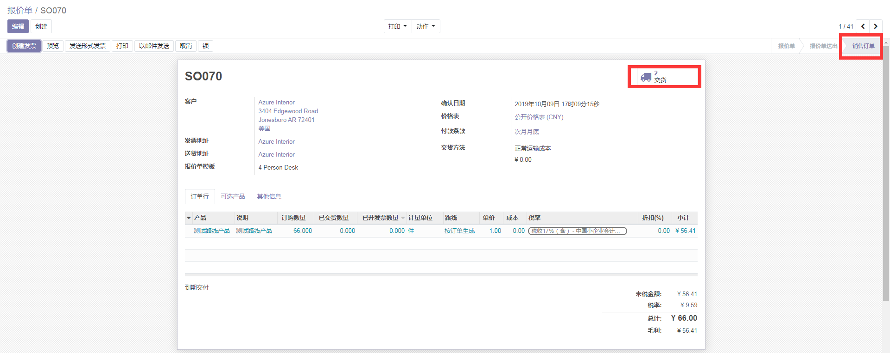
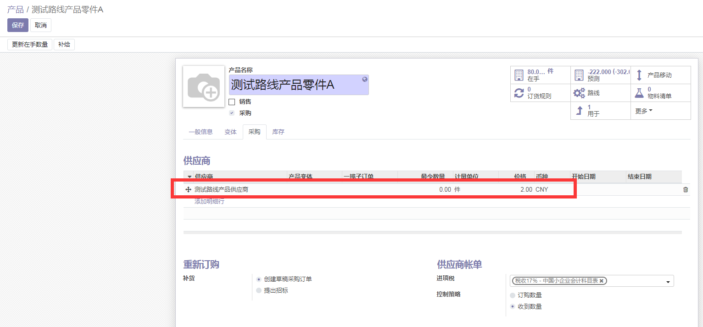
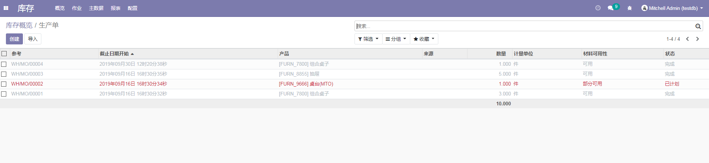
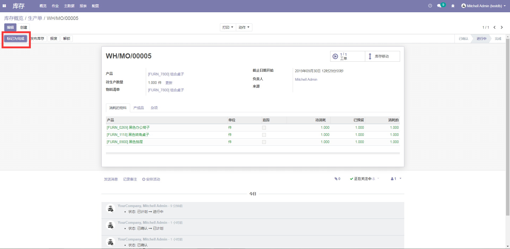
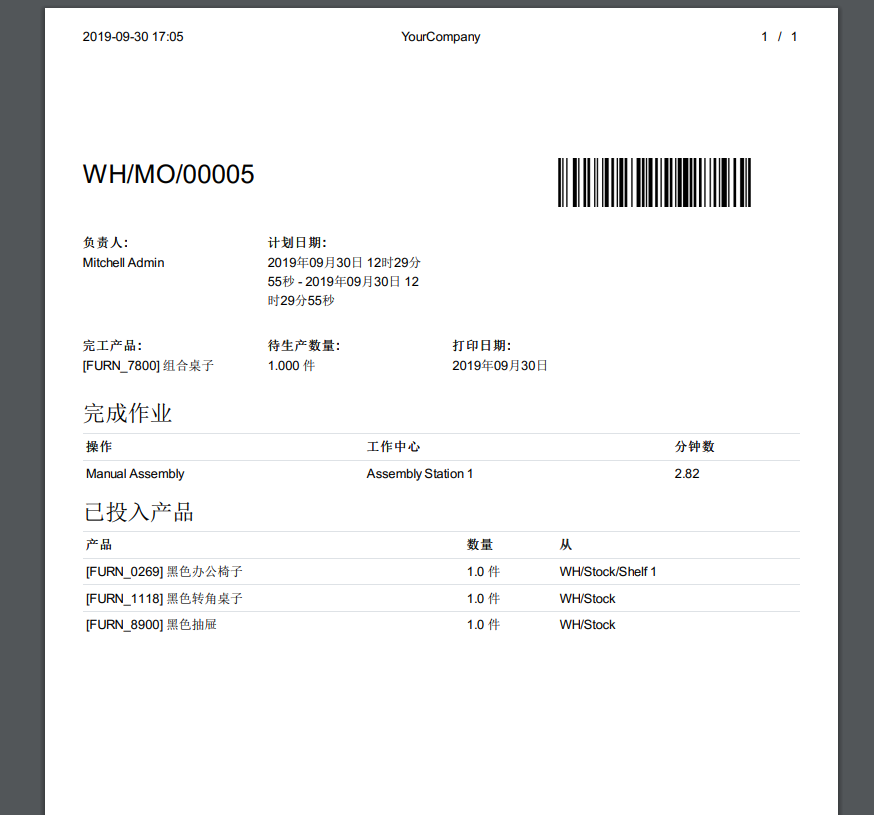

# 仓库管理板块
> wanbowen

## 09.28-09.30 | 10.08-
## 7.1.1 渠道备库发货
### 10.08-10.10 Tue-Thu
 
### 需求描述
基于渠道销售情况会产生备库单，备库单会进一步触发生产加工单的产生，采购物料、成品加工完成后入库，当库存满足出库条件后由仓管发出出库的指令。

### 解决方案
#### 方案规划：
1. 为销售订单设定可选择路线，实现该订单自动触发生产加工单、自动生成采购物料订单、物料分拣、成品加工、完成后入库，满足后出库形成出库单
2. 设定作业路线实现以上需求
#### 具体实施：
1. 在库存模块中为仓库开启三步制造 + 购买补给操作：
    
    三步制造操作对应为如图的路线：
    
1. 接下来设定产品作业路线：
    
    相应作业路线细节如下：
    
    
2. 设定好该产品物料清单：
    
3. 该产品零件的作业路线均设为 购买
4. 创建关于该产品的销售订单，并选定销售订单路线为如图：
    
5. 点击确定订单，根据所选择的MTO路线，按照作业路线优先级 销售订单路线 > 产品路线，故该订单将按照MTO路线执行，执行动作如图红框内：
    
    如图所示将会在库存模块产生交货单（由Stock->Customers触发）、三步制造的Picking Type（由Stock->Pre-Production触发），如图：
    
    > 注：所有操作的仓库对象均为YourCompany
7. 至此由销售订单已成功触发生产加工（制造）单的生产，进一步触发后续的操作
8. 接下来首先完成物料的分拣（Pick Components），分拣状态如图：
    
    由图可知系统未自动生成对应的物料采购单，这里先手动实现物料采购单，采购完成后点击检查可用性，状态变更为就绪：
    
    点击验证后状态变更为完成：
    
    物料分拣完成后进入到制造环节
9. 分拣完成后制造状态如图：
    
    点击“生产”，继续点击“记录生产”后状态如图：
    
    点击“标记为完成”，至此制造环节也完成：
    
10. 接下来为“成品加工完成后重新入库Stock”：
    
    点击验证则入库完成
11. 最后一步是成品出库交货：
    
    点击验证则出库交货成功
12. 回到销售模块中查看销售订单，点击交货按钮查看交货状态：
    
    
13. 至此，基于初始的销售订单完成了以上需求

**补充** 自动生成物料采购单操作
1. 为仓库开启购买补给：
    
    开启购买补给后会触发“购买”路线的action更新，如图：
    
2. 接下来为成品零件增加“购买”作业路线：
    
    同时务必确保零件设定了采购供应商，否则无法自动生成采购单：
    
3. 设定以上操作后新建销售订单，点击确认：
    
    点击确认后检测后台代码执行路线顺序如下：
    
    1. 首先成品（1440）按照销售订单所选的“MTO”路线连续触发规则执行如上三步
    2. 成品到达stock_rule(15,)后触发零件物料的作业路线，零件所选的路线为“MTO” + “购买”，基于优先级先执行MTO路线再执行购买路线
    3. 最终由Stock_rule(27,)触发自动生成采购单的规则
4. 进入采购模块查看自动生成的物料采购单：
    
5. 另外，自动采购也可通过设定“再订购规则”实现
#### 待解决项
1. ~~暂无法通过设定路线实现自动生成物料采购单~~（已解决）

## 7.1.2 采购相关
### 需求描述
1. 采购入库单上记录单号、业务类别、供货单位、采购部门、采购员、入库仓库货位、物料包装、物料状态、物料自由项、质检单号、物料编号、应收数量、实收数量、入库金额、计划金额等信息。
2. 采购退货时由于入库后发现质量未达到生产所要求的质量标准等原因将原料物资退回给供应商，在采购入库单中操作，退货成功后并更新采购订单的订单采购数量流程。
### 解决方案
#### 方案规划：
1. 采购入库单信息满足需求
2. 原生系统的质检过程为Stock->Quality Control，属于“内部调拨”作业类型。创建“质检”作业类型，对应为创建quality.test模型。原生系统作业类型如图：
    
    实现新的作业类型“质检”，进而满足退货定制化需求 
#### 具体实施：
与Docter协商采购相关的质检流程由质检模块负责
#### 待解决项：
### 10.11 - 10.12
## 7.1.3 组装加工入库
### 需求描述
针对企业对组装业务的需求，需要对物料进行组装业务，系统可以通过对物料属性定义成散件和套件，散件可以组装成套件来完成组装业务的完成，并自动形成入库单和出库单，散件形成出库单，套件形成入库单。
### 解决方案
#### 方案规划：
1. 与Doctor构建的BOM模块进行对接，具体内容需与Doctor商讨
2. 将制造模块中加工内容整合到库存板块
#### 具体实施：
1. 了解制造模块内容，熟悉对应模块视图逻辑
2. 了解生产单中的物料消耗情况以及生产单中工单的功能逻辑
> 存疑点：生产制造流程中，区域位置不同，如何实现多设备之间实时更新系统生产流程状态

> 散件形成出库单，套件形成入库单。此处存疑！

1. 在仓库中的仓库配置中开启制造功能：

2. 进入库存概览进行生产制造操作：

点击创建：
再点击创建工单：
点击检查可用性：
当点击“检查可用性”时，系统会自动计算消耗的物料在库存中是否足够，即满足 已预留 >= 待消耗，满足则显示如图：

不满足时产品所在的行会显示为红色。 
接下来我们点击工单执行操作：
点击列表项进入form表单，点击 开始生产 按钮：
待组装生产结束后点击 完成，回退到生产单页面，在未点击 标记为完成时，成品处于等待可用状态：
点击标记完成：
成品处于完成状态，库存移动状态完成。

3. 整个过程中物料以及成品的移动路线如图：

4. 打印出对应的生产单 & 成品单：

### 待解决项
1. 自动填写产品的批次/序列号

## 7.1.4 物资调拨
### 需求描述
对于本地仓库之间的物料转移，可采用“一步过账”调拨方式，同时改变两个仓库的物料库存，但是不改变物料的库存总量，只改变物品的存储分布；对于异地仓库之间的物料转移，可采用“二步过账”的调拨方式，可以处理运输途中损耗情况，分别对两个仓库的库存进行过账。无论哪种调拨方式，物料转移后，允许实现物料价值的改变。 
### 解决方案
#### 方案规划：
原生系统的功能描述
#### 具体实施：

## 7.3 包装管理
### 10.11
### 需求描述
建立包装类型以及包装数据模型，基本的类型包括货架托盘、箱、盒
- 采购物料：入库 -> 装箱 -> 打标 -> 上货架/上托盘
- 调拨：物料/产品的单位可以以件为单位，也可以以包装为单位
- 物流出库：以单件/包装为整体的方式出库
### 解决方案
#### 方案规划：
1. 依照需求进行设计
#### 具体实施：
1. 新建对应的交货包裹类型：
    
2. 采购物料：
    1. 首先新建采购订单，确认订单再进入库存模块的收货区，选择对应的包裹类型：
        
    2. 验证确认收货后右上角会多出一个包裹图标，该物料即存放在该包裹中：
        
    3. 进入包裹内查看，所采购的物品即在此处：
        
    4. 接下来是物流出库环节，在出库时可以选择对应的源包裹，也可以不选即按照单件的方式出库：
        
        最后点击验证即可！

## 7.4 库存记账管理
### 需求描述
	入库单记账处理

系统要求入库行为需要确认，并在系统中设置了入库单据登账的功能。根据各种入库单登记库存账本。提供一张单据记账功能，也提供一次同时登记多张单据的记账处理；同时提供取消记账功能，来处理错误操作的回退处理。系统支持多会计期间的业务，也就是说在账本上同时登记了未来几个会计期间的数据，为企业灵活处理某些业务提供了方便。

	出库单记账处理

同入库确认相同，出库行为也需要确认。根据各种出库单登记库存账本。提供一张单据记账功能，也提供一次同时登记多张单据的记账处理；提供取消记账处理功能，来处理误操作的回退功能。同样出库业务也可以处理多个会计期间的业务处理。
### 解决方案
#### 方案规划：
#### 具体实施：